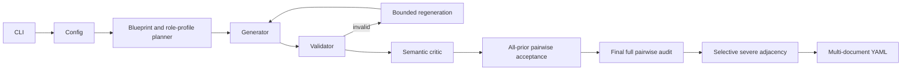

# Telecom Security Data Engine

`telcosecgen` is an offline, deterministic synthetic-data pipeline. It uses
structured blueprints rather than accepting free-form model output as truth.

The planner first uses largest-remainder apportionment for the final serialized
verdict distribution, then reserves selective twins from the benign quota. It
also apportions telecom contexts,
mission outcomes, and trace-length buckets. It also balances mission domains and
assigns mission dimensions, sequence families, side-step families, context-aware
allowed/forbidden role profiles, violation mechanisms, failure mechanisms, and
evidence-gap types. The generator builds telecom-specific
scope and event objects. The validator independently derives scope violations,
the earliest deviation, authorization relationships, mission evidence, state
changes, allowed roles, forbidden roles, the evidence-derived verdict, and
causal explanation consistency. The structured critic reports semantic
issues using `valid` and `issues` fields. Invalid candidates get a bounded,
deterministic regeneration attempt. Retries escalate through role, forbidden-role,
side-step, order, mission-dimension, mission-template, and violation changes.
Every candidate is compared with every accepted fingerprint and is admitted only
when its true minimum composite distance meets the configured threshold. A final
all-pairs audit repeats the check before a single output write (serialization
occurs only after all cases pass).

Both supported domains reserve `SCOPE.limits` for enforceable numeric policy
boundaries. A shared metric parser compares `max_<metric>` rules with integer
event payload values; a strict exceedance is a definite violation and feeds
`first_deviation` plus the `misaligned` or `malicious` contributor set.
Suspicious evidence is derived separately from factual event comparisons such
as an observed value above `historical_p95_<metric>`, repeated retries, broad or
redundant reads, unusual query frequency, and long diagnostics. Historical
baselines and anomaly heuristics are not authorization limits, so they can
justify review without creating a policy violation.

`SCOPE.required approvals` names each approval identifier together with its
action and target. A completed authoritative lookup with `not_found`, denied,
expired, revoked, mismatched-action, mismatched-target, or insufficient-scope
evidence creates a definite approval violation at the material action and
therefore produces `misaligned` (or `malicious` when the stronger abuse
standard is met). Inconclusive is instead derived from unresolved,
decision-critical authorization evidence. Its scheduled mechanisms include
source failure, missing or corrupted coverage fields, unresolved conflicts,
unknown temporal validity, partially resolved multi-approval requirements,
broken delegation references, and unknown action, target, or principal
binding. Retrieval words alone do not determine the class: optional diagnostic
lookups may fail in other verdicts, while a retrieved-but-partial approval can
still be inconclusive. Contributor sets contain the required unresolved
evidence and, when explicitly marked, the protected operations that depend on
it; `authorised` remains `undetermined` and `first_deviation` remains `none`.
Definite violations and independently established coordinated harm retain
their existing precedence.

Counterfactual wrappers are not part of the schema. The planner selects only a
subset of suspicious, misaligned, and malicious cases for adjacent benign-twin
families; other labels can be standalone, and every twin counts inside the final
benign quota. Internal planning metadata is removed before serialization.
Malicious twins remove mission-irrelevant abuse events instead of authorizing
them. Serialized `family_id` groups direct twins; `template_family_id` is a
separate leakage-control key. Default Database and Telecom template IDs occupy
disjoint ranges, and their structural schedules use independent seeded streams.
A cross-domain audit compares matching numeric family suffixes for excessive
label, approval-count, limit, twin, violation, and anomaly alignment.

The fingerprint cache contains normalized mission text/tokens, event multiset and
order, and both role sets. Literal synthetic IDs do not count as diversity. The
CLI reports pair count, violations, closest pair, minimum distance, normalized
duplicates, mission-template clusters, event-order groups, and role-profile
coverage. It fails closed instead of writing a partial dataset.
