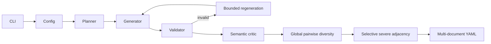

# Telecom Security Data Engine

`telcosecgen` is an offline, deterministic synthetic-data pipeline. It uses
structured blueprints rather than accepting free-form model output as truth.

The planner uses largest-remainder apportionment for verdicts, telecom contexts,
mission outcomes, and trace-length buckets. The generator builds telecom-specific
scope and event objects. The validator independently derives scope violations,
the earliest deviation, authorization relationships, mission evidence, state
changes, allowed roles, and forbidden roles. The structured critic reports semantic
issues using `valid` and `issues` fields. Invalid candidates get a bounded,
deterministic regeneration attempt, and the complete dataset is validated again
before a single output write (serialization occurs only after all cases pass).

Counterfactuals are not part of the schema. After generation, the shared ordering
planner pairs a configurable subset of severe cases with unused benign cases from
the existing allocation. Internal severity and adjacency metadata are removed
before serialization.

The engine has no network dependency and emits only synthetic identifiers. Its
main operational risk is diversity saturation for unusually large datasets;
duplicate fingerprints intentionally ignore literal IDs and reject repeated
scenario structures. The CLI fails closed instead of writing a partially
validated dataset.
