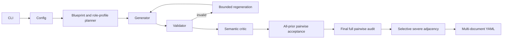

# Telecom Security Data Engine

`telcosecgen` is an offline, deterministic synthetic-data pipeline. It uses
structured blueprints rather than accepting free-form model output as truth.

The planner uses largest-remainder apportionment for verdicts, telecom contexts,
mission outcomes, and trace-length buckets. It also balances mission domains and
assigns mission dimensions, sequence families, side-step families, context-aware
allowed/forbidden role profiles, violation mechanisms, failure mechanisms, and
evidence-gap types. The generator builds telecom-specific
scope and event objects. The validator independently derives scope violations,
the earliest deviation, authorization relationships, mission evidence, state
changes, allowed roles, and forbidden roles. The structured critic reports semantic
issues using `valid` and `issues` fields. Invalid candidates get a bounded,
deterministic regeneration attempt. Retries escalate through role, forbidden-role,
side-step, order, mission-dimension, mission-template, and violation changes.
Every candidate is compared with every accepted fingerprint and is admitted only
when its true minimum composite distance meets the configured threshold. A final
all-pairs audit repeats the check before a single output write (serialization
occurs only after all cases pass).

Counterfactuals are not part of the schema. After generation, the shared ordering
planner pairs a configurable subset of severe cases with unused benign cases from
the existing allocation. Internal severity and adjacency metadata are removed
before serialization.

The fingerprint cache contains normalized mission text/tokens, event multiset and
order, and both role sets. Literal synthetic IDs do not count as diversity. The
CLI reports pair count, violations, closest pair, minimum distance, normalized
duplicates, mission-template clusters, event-order groups, and role-profile
coverage. It fails closed instead of writing a partial dataset.
